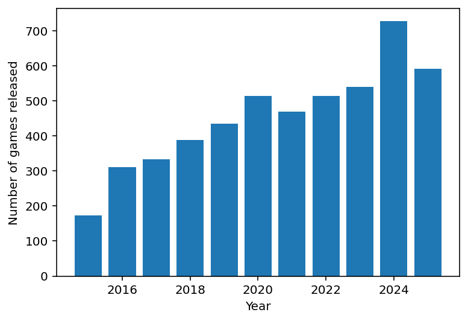
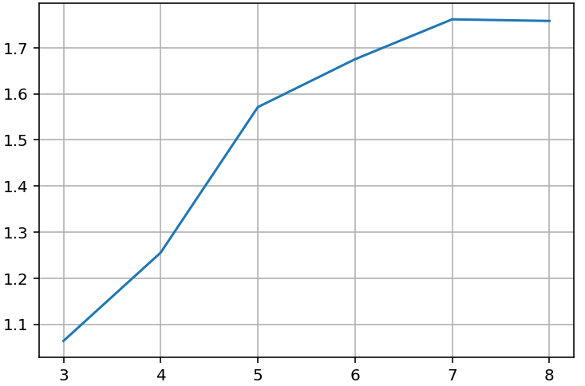

## 🧠 Overview
[](LICENSE)
[](https://www.python.org/)

This repository contains the code and instructions to reproduce the results from our paper:

### 📄 Games Mapper: Topological Data Analysis of Steam Genres
Nicolas Grelier, Pullup Entertainment  
Stéphane Kaufmann, Pullup Entertainment  
[Johannes Pfau](https://nevermindcreations.de/), Utrecht University  

arXiv: https://arxiv.org/abs/2606.14376

> This work is the successor to **SteamTrends** — *From Fads to Classics: Analyzing Video Game
> Trend Evolutions through Steam Tags* ([repository](https://github.com/JohannesPfau/SteamTrends),
> [arXiv:2506.08881](http://arxiv.org/abs/2506.08881)).

---

## 📝 Abstract
> The video game industry comprises a vast, continuously evolving landscape of themes and genres.
> For studios and publishers that navigate this competitive market, understanding the structural
> dynamics and temporal evolution of specific game categories is crucial for identifying viable
> entry points. In this paper, we introduce **Games Mapper**, a novel analytical tool based on the
> Mapper algorithm from topological data analysis. Unlike traditional clustering techniques, Games
> Mapper captures the continuous topological relationships between datasets over time (or other
> guiding variables). We extend the standard algorithm with an automated cluster labelling method,
> ensuring highly interpretable and interactive visualisations of genre evolution. To demonstrate
> the efficacy of our approach, we present a comprehensive case study on Simulation games released
> on Steam between 2015 and 2025. Games Mapper autonomously segments the genre into coherent,
> persistent subgenres, and captures dynamic market shifts. Ultimately, we provide a scalable,
> generalisable tool for researchers and industrials to unravel complex market structures and track
> the evolution of the Steam ecosystem.

**Index terms:** Mapper algorithm, game analytics, clustering, automatic cluster labelling.

---

## ⚙️ How it works

Games Mapper adapts the [Mapper algorithm](https://en.wikipedia.org/wiki/Topological_data_analysis)
from topological data analysis to Steam tag data:

1. **Data preparation** (`mapper_data_preparation.py`) — restrict the catalogue to games carrying a
   chosen tag (tag *priority* `>= 0.6`), released within a year range, and with enough reviews.
2. **Mapper levels** (`mapper_algorithm.py`) — the guiding variable (release year) is covered by
   overlapping intervals `{N, N+1}`; each interval becomes a Mapper *level*.
3. **Clustering & naming** (`cohen_clustering.py`, `utils.py`) — within each level, games are grouped
   with a weighted-tag K-means, and every cluster is **automatically named** by its most salient tags
   using Cohen's *h* effect size. The number of clusters per level is chosen via an elbow on a
   *naming score*.
4. **Graph & layout** (`plot_mapper.py`) — clusters become nodes (size ∝ number of games); edges
   connect clusters in consecutive levels that share games (weight ∝ overlap). A layer-ordering
   heuristic minimises edge crossings.
5. **Visualisation** — an interactive Plotly graph where hovering a node reveals its top games by
   review count.

---

## 📈 Figures

 

*Left: Simulation games released on Steam per year (2015–2025). Right: the naming-score elbow used
to pick the number of clusters in a level.*

The main output is an **interactive** layered Mapper graph. Open
[`results/simulation_games_mapper.html`](results/simulation_games_mapper.html) in a browser to
explore the Simulation case study (or regenerate it with `python ./src/main.py`).

---

## 🗂️ Repository Structure
```yaml
GamesMapper/
├── src/                              # Source code for the Games Mapper pipeline
│   ├── main.py                       #   entry point — reproduces the Simulation case study
│   ├── gdco_data.py                  #   load gdco_data.csv → (tags, reference) dataframes
│   ├── merge_gdco_data.py            #   one-time helper: build gdco_data.csv from the raw exports
│   ├── clean_gdco_data.py            #   one-time helper: build the committed gdco_simulation.csv subset
│   ├── mapper_data_preparation.py    #   load & clean Steam data, restrict to a tag and year range
│   ├── mapper_algorithm.py           #   build Mapper levels, run the elbow method, assemble clusters
│   ├── cohen_clustering.py           #   weighted-tag K-means + Cohen's h salient-tag scoring
│   ├── plot_mapper.py                #   layered-graph layout + interactive Plotly drawing
│   └── utils.py                      #   Cohen's h helpers and automatic cluster naming
├── data/                             # Input data — committed gdco_simulation.csv (see data/README.md)
├── results/                          # Outputs of the pipeline
│   ├── simulation_games_mapper.html  #   interactive Mapper graph (open in a browser)
│   ├── dict_level_to_cluster.pkl     #   precomputed clustering of the Simulation case study
│   └── figures/                      #   static figures (used in the paper and this README)
├── analyses/                         # Additional, self-contained Steam analyses
│   ├── best_of_steam/                #   "Best of Steam" new-releases & sellers clustering
│   └── demos_next_fest/              #   Steam Next Fest demo trends
├── presentation/                     # Talk slides
│   └── Game Camp 2026.pptx
├── requirements.txt                  # Python dependencies
├── LICENSE                           # MIT
├── README.md
└── GamesMapper-paper.pdf             # the paper
```

## 🚀 Getting Started

### Prerequisites

- Python >= 3.10
- Recommended: use a virtual environment or Conda.
- No data download needed: the case-study input `data/gdco_simulation.csv` ships with the
  repo (see [`data/README.md`](data/README.md) for its schema and the full dataset).

### Setup

Clone the repo:
```bash
git clone https://github.com/JohannesPfau/GamesMapper.git
cd GamesMapper
```

Create and activate a virtual environment, then install the dependencies:
```bash
python -m venv env
source env/bin/activate      # or `env\Scripts\activate` on Windows
pip install -r requirements.txt
```

### Running the code

From the repository root:
```bash
python ./src/main.py
```

By default this reproduces the case study from the paper: it analyses the `Simulation` tag over
2015–2025 and opens the interactive Mapper graph in your browser. `gdco_simulation.csv` contains
only Simulation games — to analyse a different genre, a wider year range, or a review threshold
below 100, point `path_data` in [`src/main.py`](src/main.py) at the full `data/gdco_data.csv` and
edit `TAG` (see [`data/README.md`](data/README.md)).

---

## 🔬 Additional analyses

The [`analyses/`](analyses/) folder contains two further, self-contained Steam studies, each with
its own README:

- [`analyses/best_of_steam/`](analyses/best_of_steam/) — clustering of Steam's yearly "Best of
  Steam" new releases and top sellers (2019–2025).
- [`analyses/demos_next_fest/`](analyses/demos_next_fest/) — demo follower-growth and tag trends
  across the 2025 and 2026 Steam Next Fests.

---

## 📚 Citation

If you use this work, please cite the paper:

```bibtex
@inproceedings{grelier2026gamesmapper,
      title={Games Mapper: Topological Data Analysis of Steam Genres}, 
	  author={Grelier, Nicolas and Kaufmann, St\'ephane and Pfau, Johannes},
      year={2026},
      eprint={2606.14376},
      archivePrefix={arXiv},
      primaryClass={cs.SI},
      url={https://arxiv.org/abs/2606.14376}, 
}
```

## 📄 License

Released under the [MIT License](LICENSE).
